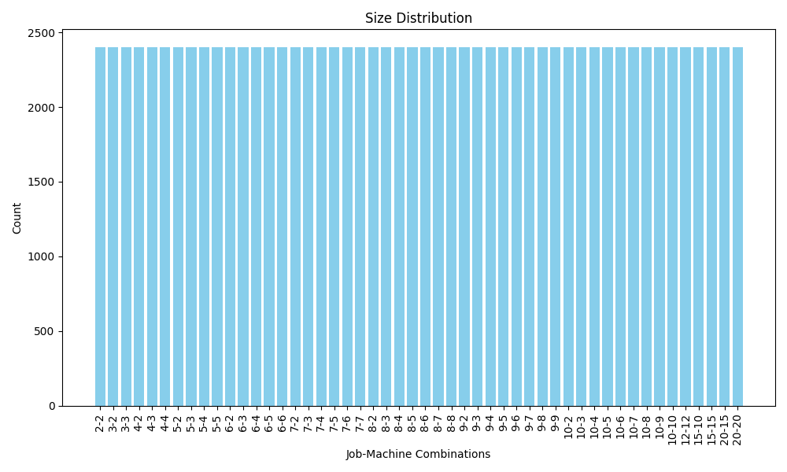
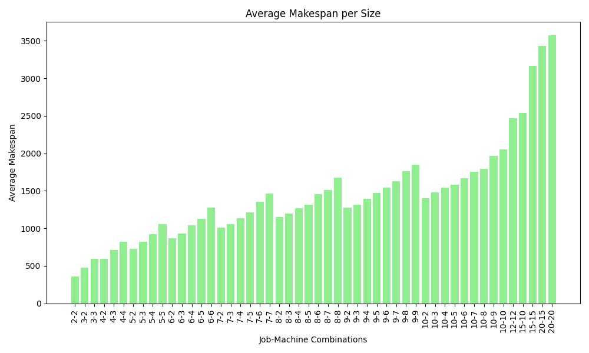
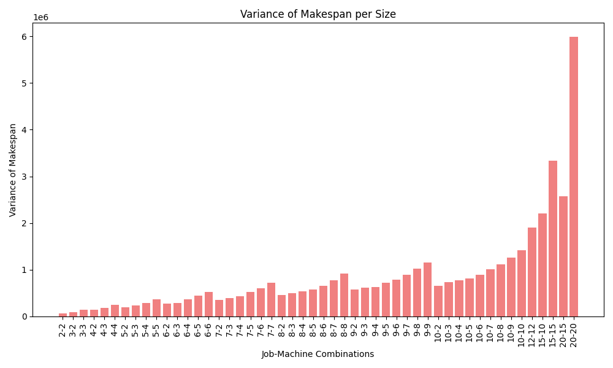
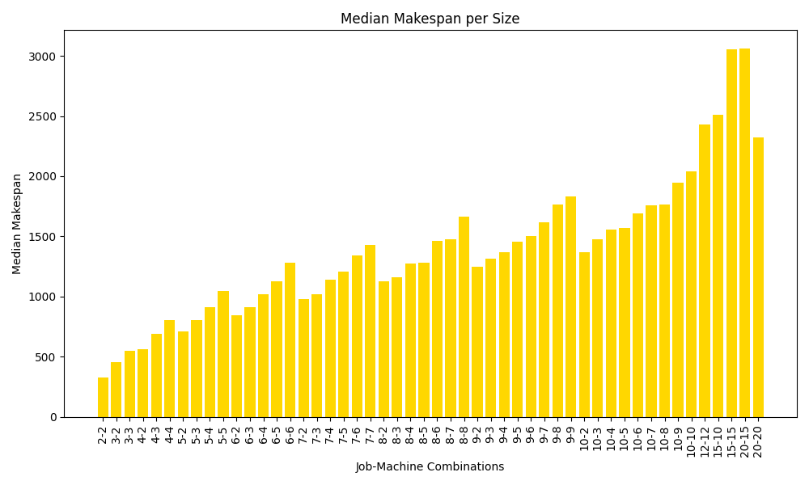
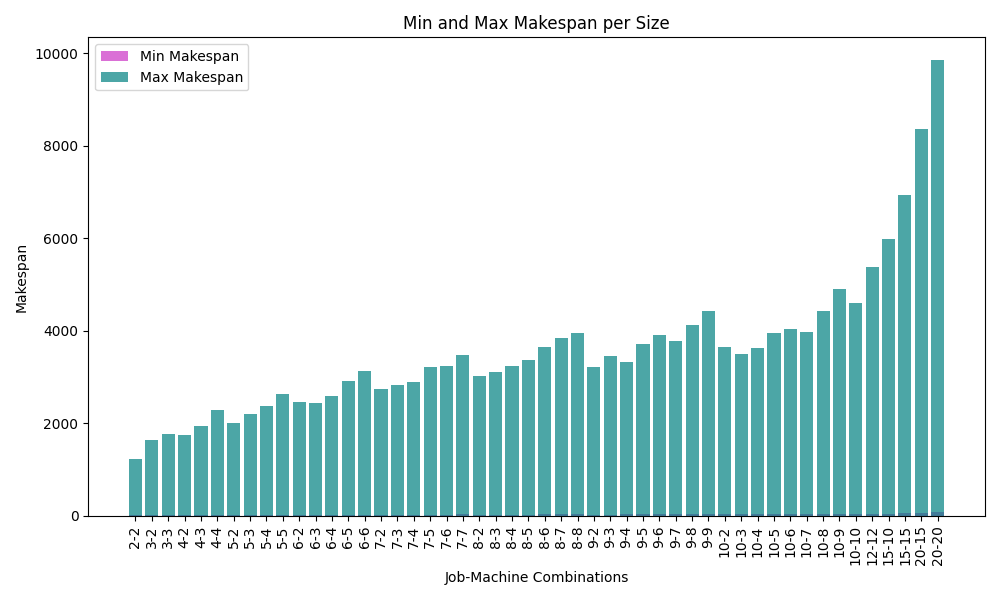
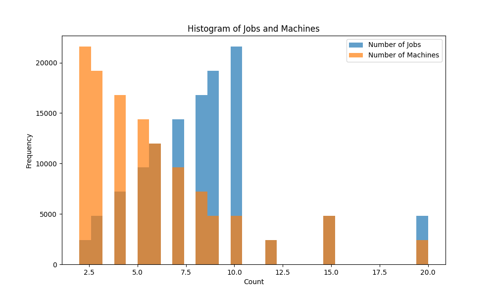
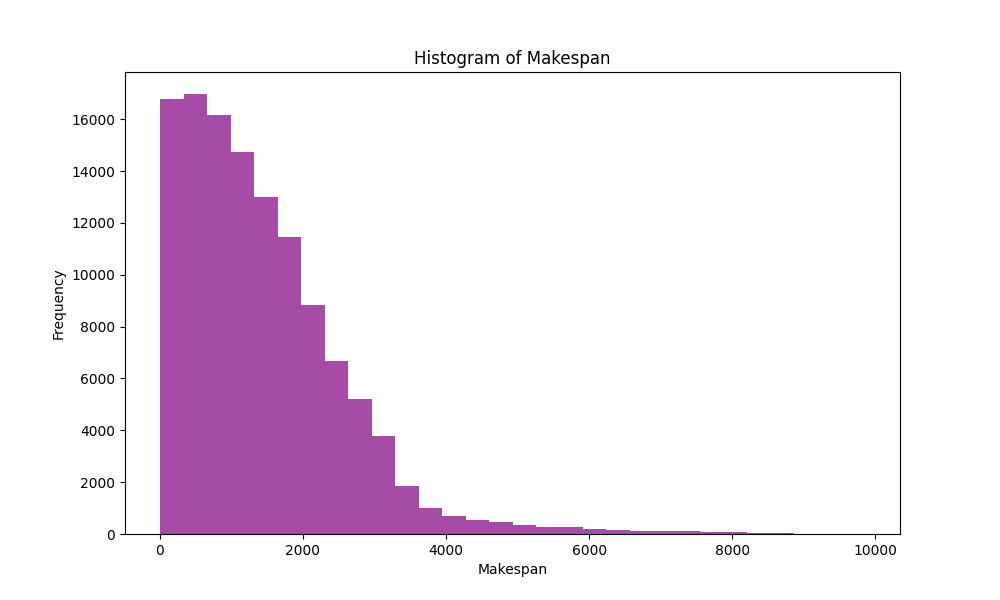

# Cloning the repository and downloading the dataset

This repository contains the dataset named "jssp_llm_format_120k.json" by Git Large File Storage (LFS). Follow the steps below to ensure you can properly clone the repository and access the large files.

## Prerequisites

- Git
- Git LFS (download and install from [Git LFS website](https://git-lfs.github.com/))

## Setup Instructions

### Step 1: Install Git LFS

Ensure Git LFS is installed on your system. If it is not already installed, you can install it by running:

```sh
git lfs install
``` 

### Step 2: Clone the Repository
```sh
git clone https://github.com/starjob42/datasetjsp.git
cd datasetjsp
```

Step 3: Pull LFS Objects
After cloning the repository, ensure Git LFS pulls the large files:

```sh
git lfs pull

```
Step 4: Viewing the DataCard
To view the datacard please run the following code:

```sh
python read_datacard.py

```

If Git LFS does not work, the dataset can also be downloaded from:
([google drive](https://drive.google.com/drive/folders/1EChWtjhYQSWMdMiGEm4t5GGtB_jKpbPC?usp=sharing))


# Setting Up Your Python Environment

Follow these instructions to create a virtual environment and install the necessary libraries.

## Step 1: Create a Virtual Environment

```bash
python3 -m venv llm_env
```

Activate the Virtual Environment
After creating the virtual environment, activate it using the following command:

On Windows
```bash
.\llm_env\Scripts\activate
```

On macOS and Linux
```bash
source llm_env/bin/activate
```

# Install the Required Libraries
```bash
pip install -r requirements.txt
```

# Training
Make sure to pass correct path to the trainig dataset. The default path is './jssp_llm_format_120k.json'

```bash
python train_phi3_lora_jssp.py
```
To infer use the following command, which uses 'test_2000.json' testing dataset

```bash
python infer_phi3.py
```

# JSSP LLM Format Dataset

## Dataset Overview

**Dataset Name:** jssp_llm_format_120k.json
**Number of Entries:** 120,000  
**Number of Fields:** 5  

## Fields Description

1. **num_jobs**
   - **Type:** int64
   - **Number of Unique Values:** 12
   
2. **num_machines**
   - **Type:** int64
   - **Number of Unique Values:** 12
   
3. **prompt_jobs_first**
   - **Type:** object
   - **Number of Unique Values:** 120,000
   
4. **prompt_machines_first**
  - **Type:** object
  - **Number of Unique Values:** 120,000

5. **output**
   - **Type:** object
   - **Number of Unique Values:** 120,000
   
## Usage

This dataset can be used for training LLMs for job-shop scheduling problems (JSSP). Each entry provides information about the number of jobs, the number of machines, and other relevant details formatted in natural language.

## License

This dataset is licensed under the Creative Commons Attribution-ShareAlike 4.0 International (CC BY-SA 4.0). For more details, see the [license description](https://creativecommons.org/licenses/by-sa/4.0/). The dataset will remain accessible for an extended period.


## Citation

If you use this dataset in your research, please cite it as follows:

```sh

@dataset{jssp_for_llm,
author = {Anonymous},
title = {LLMs can Schedule},
year = {2024},
url = {https://github.com/starjob42/datasetjsp.git},
note = {Submitted to NeurIPS 2024 Datasets and Benchmarks}

}

```

# Job Shop Scheduling Dataset for LLM
# General Statistics

- **total_samples**: 120000
- **unique_sizes**: 50
- **data_size_of_group_size_of_instances**: 2400
- **average_jobs**: 8.24
- **average_machines**: 5.64
- **average_makespan**: 1434.3538358961537
- **makespan_variance**: 1292087.1381092232
- **median_makespan**: 1211.0
- **min_makespan**: 5.0
- **max_makespan**: 9852.0

- ## Correlations
- **correlation_jobs_makespan**: 0.5658973838191064
- **correlation_machines_makespan**: 0.5480905138716899

## Size Distribution


## Average Makespan per Size


## Variance of Makespan per Size


## Median Makespan per Size


## Minimum and Maximum Makespan per Size



## Histograms



