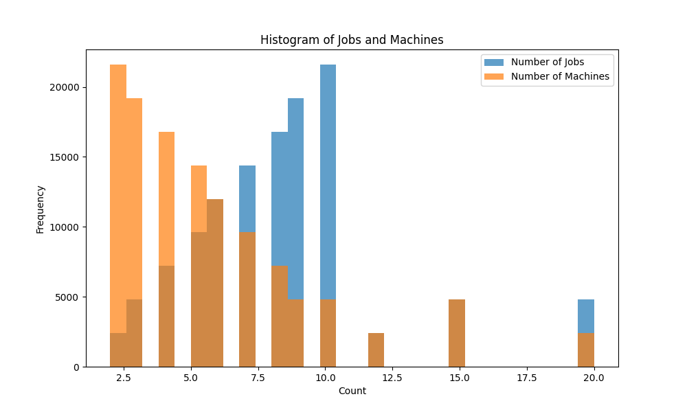
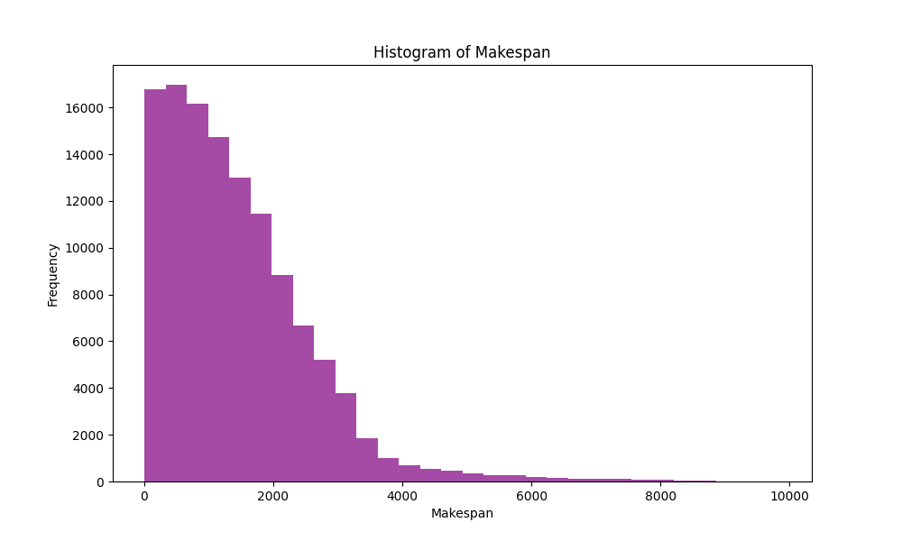

# Job Shop Scheduling Dataset Statistics

## General Statistics
- **total_samples**: 120000
- **unique_sizes**: 50
- **average_jobs**: 8.24
- **average_machines**: 5.64
- **average_makespan**: 1434.3538358961537
- **makespan_variance**: 1292087.1381092232
- **median_makespan**: 1211.0
- **min_makespan**: 5.0
- **max_makespan**: 9852.0

## Size Distribution
|   num_jobs |   num_machines |   count |
|-----------:|---------------:|--------:|
|          2 |              2 |    2400 |
|          3 |              2 |    2400 |
|          3 |              3 |    2400 |
|          4 |              2 |    2400 |
|          4 |              3 |    2400 |
|          4 |              4 |    2400 |
|          5 |              2 |    2400 |
|          5 |              3 |    2400 |
|          5 |              4 |    2400 |
|          5 |              5 |    2400 |
|          6 |              2 |    2400 |
|          6 |              3 |    2400 |
|          6 |              4 |    2400 |
|          6 |              5 |    2400 |
|          6 |              6 |    2400 |
|          7 |              2 |    2400 |
|          7 |              3 |    2400 |
|          7 |              4 |    2400 |
|          7 |              5 |    2400 |
|          7 |              6 |    2400 |
|          7 |              7 |    2400 |
|          8 |              2 |    2400 |
|          8 |              3 |    2400 |
|          8 |              4 |    2400 |
|          8 |              5 |    2400 |
|          8 |              6 |    2400 |
|          8 |              7 |    2400 |
|          8 |              8 |    2400 |
|          9 |              2 |    2400 |
|          9 |              3 |    2400 |
|          9 |              4 |    2400 |
|          9 |              5 |    2400 |
|          9 |              6 |    2400 |
|          9 |              7 |    2400 |
|          9 |              8 |    2400 |
|          9 |              9 |    2400 |
|         10 |              2 |    2400 |
|         10 |              3 |    2400 |
|         10 |              4 |    2400 |
|         10 |              5 |    2400 |
|         10 |              6 |    2400 |
|         10 |              7 |    2400 |
|         10 |              8 |    2400 |
|         10 |              9 |    2400 |
|         10 |             10 |    2400 |
|         12 |             12 |    2400 |
|         15 |             10 |    2400 |
|         15 |             15 |    2400 |
|         20 |             15 |    2400 |
|         20 |             20 |    2400 |
## Average Makespan per Size
|   num_jobs |   num_machines |   makespan |
|-----------:|---------------:|-----------:|
|          2 |              2 |    357.873 |
|          3 |              2 |    478.592 |
|          3 |              3 |    589.054 |
|          4 |              2 |    593.63  |
|          4 |              3 |    707.247 |
|          4 |              4 |    821.872 |
|          5 |              2 |    727.252 |
|          5 |              3 |    822.478 |
|          5 |              4 |    920.099 |
|          5 |              5 |   1051.65  |
|          6 |              2 |    864.327 |
|          6 |              3 |    930.018 |
|          6 |              4 |   1036.75  |
|          6 |              5 |   1127.55  |
|          6 |              6 |   1273.78  |
|          7 |              2 |   1004.65  |
|          7 |              3 |   1054.37  |
|          7 |              4 |   1137.29  |
|          7 |              5 |   1211.37  |
|          7 |              6 |   1353.85  |
|          7 |              7 |   1464.42  |
|          8 |              2 |   1147.1   |
|          8 |              3 |   1195.82  |
|          8 |              4 |   1268.17  |
|          8 |              5 |   1313.26  |
|          8 |              6 |   1453.78  |
|          8 |              7 |   1512.37  |
|          8 |              8 |   1672.54  |
|          9 |              2 |   1278.93  |
|          9 |              3 |   1316.97  |
|          9 |              4 |   1391.33  |
|          9 |              5 |   1469.5   |
|          9 |              6 |   1542.62  |
|          9 |              7 |   1624.06  |
|          9 |              8 |   1762.8   |
|          9 |              9 |   1850.96  |
|         10 |              2 |   1397.01  |
|         10 |              3 |   1481.5   |
|         10 |              4 |   1539.84  |
|         10 |              5 |   1578.64  |
|         10 |              6 |   1667.6   |
|         10 |              7 |   1753.63  |
|         10 |              8 |   1795.55  |
|         10 |              9 |   1968.73  |
|         10 |             10 |   2050.58  |
|         12 |             12 |   2466.48  |
|         15 |             10 |   2538.04  |
|         15 |             15 |   3161.65  |
|         20 |             15 |   3431.56  |
|         20 |             20 |   3571.91  |
## Variance of Makespan per Size
|   num_jobs |   num_machines |         makespan |
|-----------:|---------------:|-----------------:|
|          2 |              2 |  55591.2         |
|          3 |              2 |  87491.9         |
|          3 |              3 | 138521           |
|          4 |              2 | 135180           |
|          4 |              3 | 184842           |
|          4 |              4 | 246282           |
|          5 |              2 | 187755           |
|          5 |              3 | 237675           |
|          5 |              4 | 284779           |
|          5 |              5 | 362548           |
|          6 |              2 | 269400           |
|          6 |              3 | 281160           |
|          6 |              4 | 357303           |
|          6 |              5 | 438756           |
|          6 |              6 | 525338           |
|          7 |              2 | 349864           |
|          7 |              3 | 390228           |
|          7 |              4 | 432358           |
|          7 |              5 | 515985           |
|          7 |              6 | 602693           |
|          7 |              7 | 722788           |
|          8 |              2 | 457421           |
|          8 |              3 | 492170           |
|          8 |              4 | 533593           |
|          8 |              5 | 578507           |
|          8 |              6 | 657173           |
|          8 |              7 | 773319           |
|          8 |              8 | 920443           |
|          9 |              2 | 566961           |
|          9 |              3 | 607085           |
|          9 |              4 | 631404           |
|          9 |              5 | 712324           |
|          9 |              6 | 784957           |
|          9 |              7 | 891391           |
|          9 |              8 |      1.02295e+06 |
|          9 |              9 |      1.15381e+06 |
|         10 |              2 | 647144           |
|         10 |              3 | 734263           |
|         10 |              4 | 766476           |
|         10 |              5 | 806407           |
|         10 |              6 | 887462           |
|         10 |              7 |      1.01201e+06 |
|         10 |              8 |      1.10979e+06 |
|         10 |              9 |      1.25509e+06 |
|         10 |             10 |      1.41212e+06 |
|         12 |             12 |      1.90603e+06 |
|         15 |             10 |      2.21038e+06 |
|         15 |             15 |      3.33062e+06 |
|         20 |             15 |      2.57853e+06 |
|         20 |             20 |      5.99089e+06 |
## Median Makespan per Size
|   num_jobs |   num_machines |   makespan |
|-----------:|---------------:|-----------:|
|          2 |              2 |      325   |
|          3 |              2 |      451   |
|          3 |              3 |      546.5 |
|          4 |              2 |      564   |
|          4 |              3 |      687.5 |
|          4 |              4 |      805.5 |
|          5 |              2 |      708.5 |
|          5 |              3 |      803   |
|          5 |              4 |      913   |
|          5 |              5 |     1045   |
|          6 |              2 |      842   |
|          6 |              3 |      913.5 |
|          6 |              4 |     1016.5 |
|          6 |              5 |     1129   |
|          6 |              6 |     1280   |
|          7 |              2 |      979.5 |
|          7 |              3 |     1022   |
|          7 |              4 |     1140   |
|          7 |              5 |     1209   |
|          7 |              6 |     1344   |
|          7 |              7 |     1430   |
|          8 |              2 |     1124   |
|          8 |              3 |     1163   |
|          8 |              4 |     1276   |
|          8 |              5 |     1281   |
|          8 |              6 |     1463   |
|          8 |              7 |     1477.5 |
|          8 |              8 |     1662   |
|          9 |              2 |     1245   |
|          9 |              3 |     1315   |
|          9 |              4 |     1370.5 |
|          9 |              5 |     1457.5 |
|          9 |              6 |     1503.5 |
|          9 |              7 |     1615   |
|          9 |              8 |     1767   |
|          9 |              9 |     1829   |
|         10 |              2 |     1370   |
|         10 |              3 |     1474   |
|         10 |              4 |     1553.5 |
|         10 |              5 |     1570   |
|         10 |              6 |     1687.5 |
|         10 |              7 |     1760   |
|         10 |              8 |     1762.5 |
|         10 |              9 |     1946.5 |
|         10 |             10 |     2039   |
|         12 |             12 |     2432   |
|         15 |             10 |     2511.5 |
|         15 |             15 |     3056.5 |
|         20 |             15 |     3061   |
|         20 |             20 |     2322   |
## Minimum Makespan per Size
|   num_jobs |   num_machines |   makespan |
|-----------:|---------------:|-----------:|
|          2 |              2 |          5 |
|          3 |              2 |          8 |
|          3 |              3 |          9 |
|          4 |              2 |          7 |
|          4 |              3 |         11 |
|          4 |              4 |         15 |
|          5 |              2 |         12 |
|          5 |              3 |         15 |
|          5 |              4 |         15 |
|          5 |              5 |         19 |
|          6 |              2 |         16 |
|          6 |              3 |         14 |
|          6 |              4 |         18 |
|          6 |              5 |         18 |
|          6 |              6 |         23 |
|          7 |              2 |         15 |
|          7 |              3 |         18 |
|          7 |              4 |         19 |
|          7 |              5 |         23 |
|          7 |              6 |         22 |
|          7 |              7 |         26 |
|          8 |              2 |         18 |
|          8 |              3 |         20 |
|          8 |              4 |         21 |
|          8 |              5 |         22 |
|          8 |              6 |         26 |
|          8 |              7 |         29 |
|          8 |              8 |         30 |
|          9 |              2 |         20 |
|          9 |              3 |         22 |
|          9 |              4 |         24 |
|          9 |              5 |         25 |
|          9 |              6 |         27 |
|          9 |              7 |         29 |
|          9 |              8 |         30 |
|          9 |              9 |         34 |
|         10 |              2 |         28 |
|         10 |              3 |         25 |
|         10 |              4 |         24 |
|         10 |              5 |         30 |
|         10 |              6 |         26 |
|         10 |              7 |         32 |
|         10 |              8 |         33 |
|         10 |              9 |         39 |
|         10 |             10 |         37 |
|         12 |             12 |         45 |
|         15 |             10 |         45 |
|         15 |             15 |         55 |
|         20 |             15 |         64 |
|         20 |             20 |         76 |
## Maximum Makespan per Size
|   num_jobs |   num_machines |   makespan |
|-----------:|---------------:|-----------:|
|          2 |              2 |       1223 |
|          3 |              2 |       1626 |
|          3 |              3 |       1770 |
|          4 |              2 |       1754 |
|          4 |              3 |       1945 |
|          4 |              4 |       2280 |
|          5 |              2 |       2013 |
|          5 |              3 |       2194 |
|          5 |              4 |       2375 |
|          5 |              5 |       2629 |
|          6 |              2 |       2460 |
|          6 |              3 |       2435 |
|          6 |              4 |       2589 |
|          6 |              5 |       2901 |
|          6 |              6 |       3121 |
|          7 |              2 |       2742 |
|          7 |              3 |       2831 |
|          7 |              4 |       2879 |
|          7 |              5 |       3206 |
|          7 |              6 |       3244 |
|          7 |              7 |       3471 |
|          8 |              2 |       3019 |
|          8 |              3 |       3097 |
|          8 |              4 |       3245 |
|          8 |              5 |       3372 |
|          8 |              6 |       3639 |
|          8 |              7 |       3831 |
|          8 |              8 |       3959 |
|          9 |              2 |       3224 |
|          9 |              3 |       3444 |
|          9 |              4 |       3313 |
|          9 |              5 |       3715 |
|          9 |              6 |       3899 |
|          9 |              7 |       3771 |
|          9 |              8 |       4120 |
|          9 |              9 |       4425 |
|         10 |              2 |       3648 |
|         10 |              3 |       3492 |
|         10 |              4 |       3634 |
|         10 |              5 |       3941 |
|         10 |              6 |       4027 |
|         10 |              7 |       3969 |
|         10 |              8 |       4415 |
|         10 |              9 |       4897 |
|         10 |             10 |       4593 |
|         12 |             12 |       5380 |
|         15 |             10 |       5988 |
|         15 |             15 |       6932 |
|         20 |             15 |       8372 |
|         20 |             20 |       9852 |
## Correlations
- **correlation_jobs_makespan**: 0.5658973838191064
- **correlation_machines_makespan**: 0.5480905138716899

## Histograms

